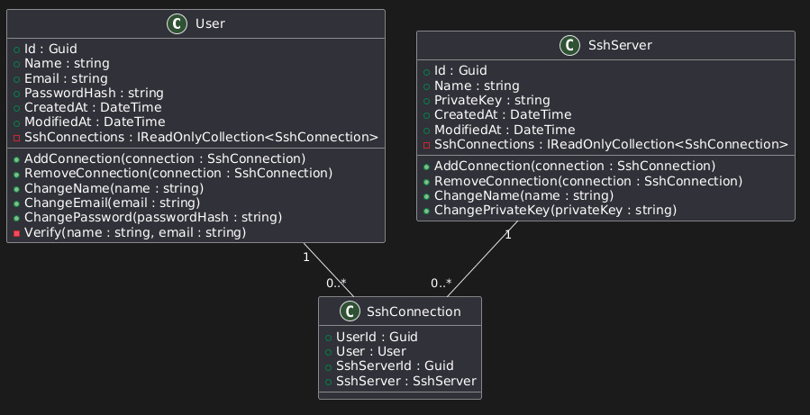
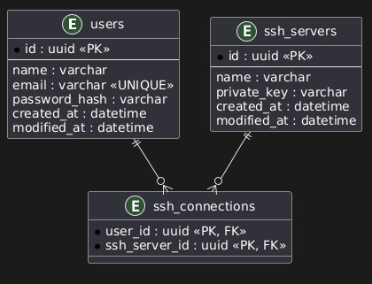

# CipherGate

<p align="center">
  <strong>Gerenciamento de conexões SSH diretamente pelo navegador.</strong>
</p>

<p align="center">
  Cadastre servidores, organize conexões e acesse múltiplos terminais SSH simultaneamente em uma única interface.
</p>

---

## Sobre

O **CipherGate** é um sistema web para gerenciamento de conexões SSH.

O objetivo do projeto é centralizar o acesso aos servidores em uma interface moderna, eliminando a necessidade de abrir diversos terminais locais e facilitando a administração de múltiplas máquinas.

Cada usuário gerencia seus próprios servidores e pode abrir diversas sessões SSH simultaneamente através do navegador.

---

## Funcionalidades

- Cadastro de servidores SSH
- Autenticação de usuários
- Conexão SSH diretamente pelo navegador
- Suporte a múltiplas abas de terminal
- Gerenciamento individual de servidores por usuário
- Armazenamento seguro das credenciais SSH
- Interface simples e responsiva

---

## Modelagem

### Diagrama de Classes

<p align="center">
  
</p>

### Modelo Entidade-Relacionamento

<p align="center">
  
</p>

---

## Tecnologias

### Backend

- ASP.NET Core
- C#
- Entity Framework Core
- SignalR

### Banco de Dados

- MariaDB


### Infraestrutura

- Docker
- Docker Compose

---

## Estrutura Inicial

```text
CipherGate
├── src
│   ├── CipherGate.API
│   ├── CipherGate.Application
│   ├── CipherGate.Domain
│   ├── CipherGate.Infrastructure
│   └── CipherGate.Presentation
│
├── docs
│   └── images
│       ├── class-diagram.png
│       └── database-diagram.png
│
└── README.md
```

---

## Roadmap

### MVP

- [ ] Cadastro de usuários
- [ ] Login
- [ ] Cadastro de servidores SSH
- [ ] Abrir conexão SSH
- [ ] Terminal Web
- [ ] Múltiplas abas
- [ ] Listagem de servidores

### Futuro

- [ ] Histórico de conexões
- [ ] Auditoria
- [ ] Compartilhamento de servidores
- [ ] Upload/Download via SFTP
- [ ] Monitoramento de servidores
- [ ] Execução de comandos em lote
- [ ] Organização por grupos
- [ ] Temas do terminal
- [ ] Sessões persistentes

---

## Objetivo

Este projeto tem como objetivo aprofundar conhecimentos em:

- Clean Architecture
- Domain-Driven Design (DDD)
- Entity Framework Core
- Comunicação em tempo real com SignalR
- Integração com SSH
- Modelagem de banco de dados
- Docker
- Arquitetura de aplicações web
